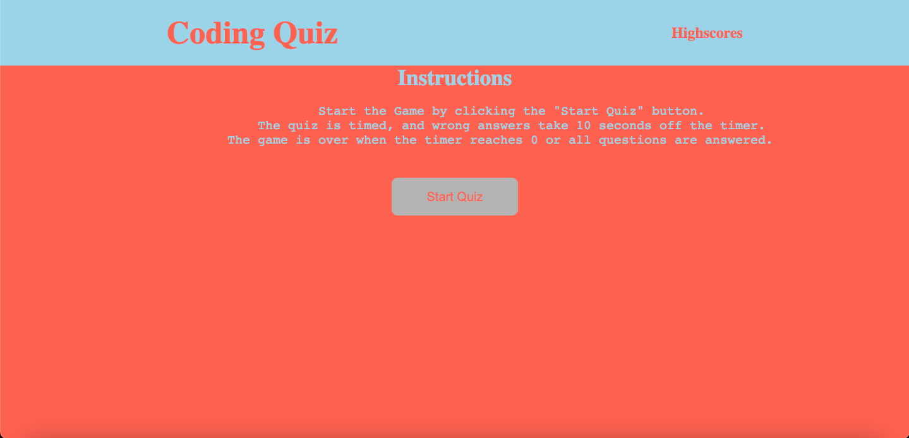
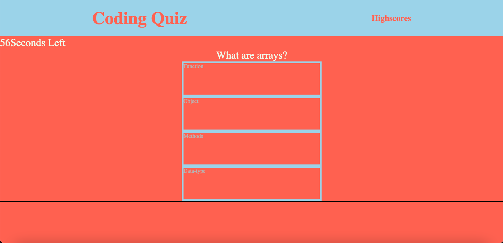
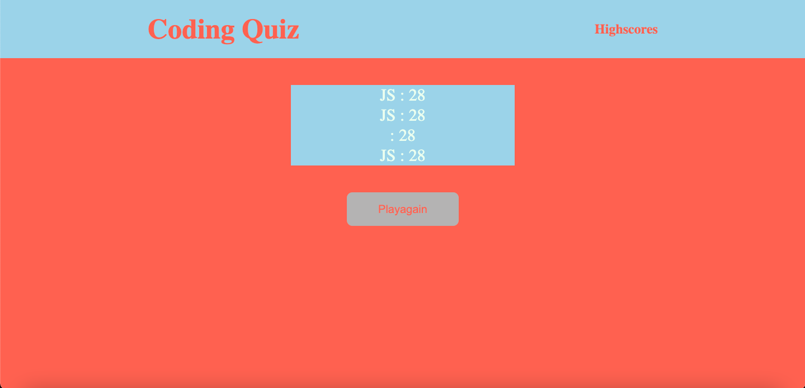

# word-guess-game-w4
## Javascript Code Quiz

## User Story

```
AS A coding boot camp student
I WANT to take a timed quiz on JavaScript fundamentals that stores high scores
SO THAT I can gauge my progress compared to my peers
```

## Acceptance Criteria

```
GIVEN I am taking a code quiz
WHEN I click the start button
THEN a timer starts and I am presented with a question
WHEN I answer a question
THEN I am presented with another question
WHEN I answer a question incorrectly
THEN time is subtracted from the clock
WHEN all questions are answered or the timer reaches 0
THEN the game is over
WHEN the game is over
THEN I can save my initials and my score
```

## About 

The folllowing application is a Dynamically created page.  
It uses javascript to create the questions, highscore form and list.  
It also utilizes local storage to save all previous highscores and renders it to the page. 

## Creating the page
To create the page I started five functions that will handle keeping track of the time, score, highscores, and creating all the elements on the page.  
I then created two buttons.  
    1. One on the home page to start the quiz  
    2. The second one to submit the users initials and score to be saved on the page.  
I kept the color scheme simple and with bright colors so that the UI looks good to the user.  
The page uses semantic HTML elements, and vanilla Javascript.  

## Deployed application

### Link to page
[Code Quiz](https://juawito.github.io/word-guess-game-w4/)

### Start Screen


### Questions screen


### Highscore screen



